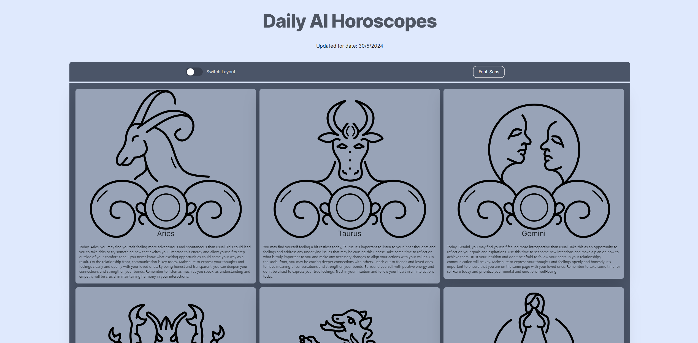
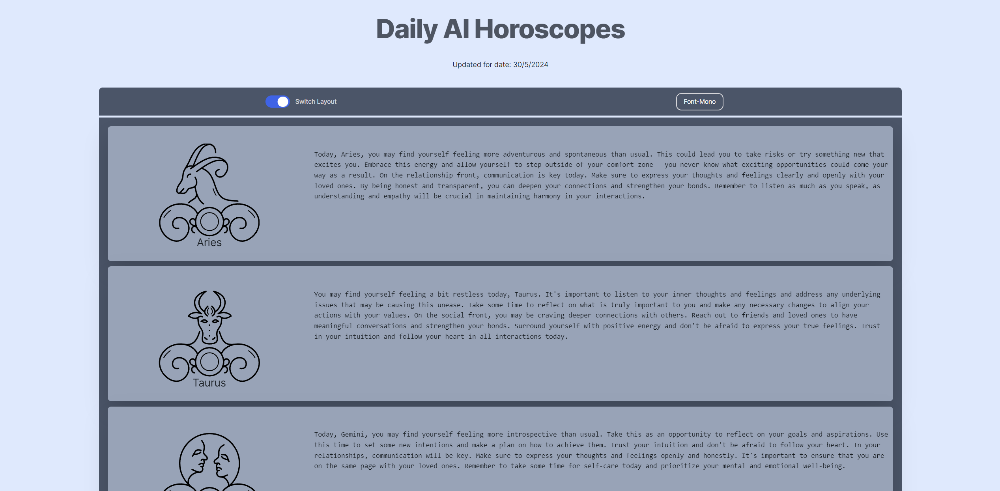

## Getting Started

First, run the development server:

```bash
npm run dev
# or
next dev
```

You also need an enviorment file that contains all the api keys for: (OpenAI,MongoDB)

Open [http://localhost:3000](http://localhost:3000) with your browser to see the application.

This project uses [`next/font`](https://nextjs.org/docs/basic-features/font-optimization) to automatically optimize and load Inter, a custom Google Font.

## How everything is built:

The architucture for this app is that it has a monodb backend where it saves the horoscopes and the date they were generated at, meaning that the horoscope readings are decoupled from the project, and on another server.

The hosted application on vercel has a cron daily task which runs (/api/updateHoroscopes), and what it does is that it utilizes the OpenAI API and establishes a connection with the mongodb database and updates the horoscope readings there, which happens every day at 9 AM.

## The state of the vercel instance

it's currently running at:

```bash
https://ai-horoscopes.vercel.app/
```

## Screenshots that showcase the application






